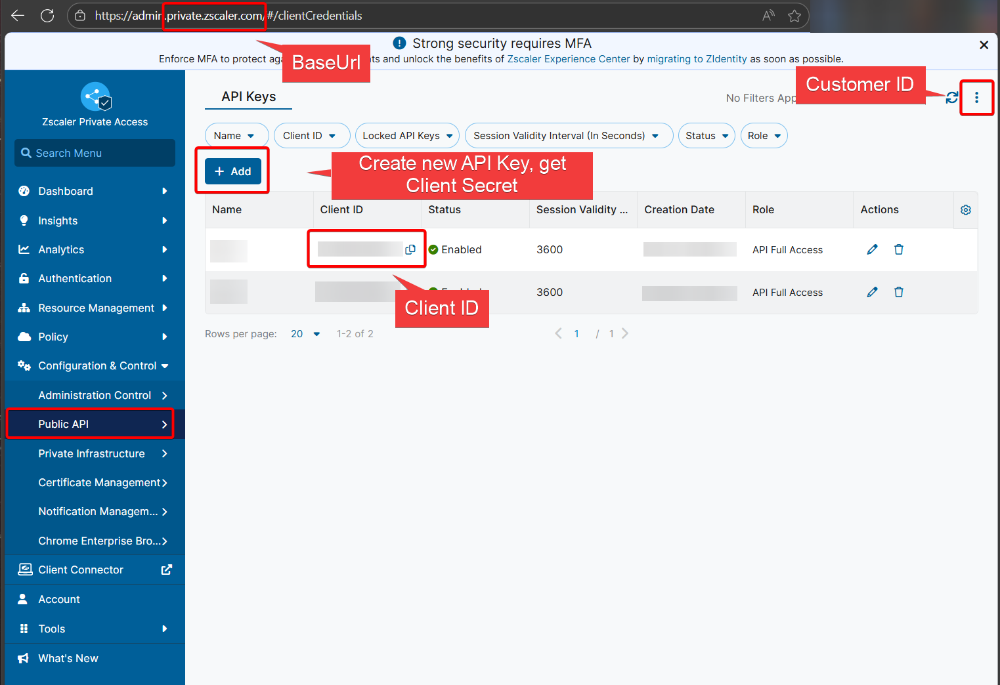

### Overview

`Export-ZPAConfig` provides a comprehensive backup solution for your Zscaler Private Access (ZPA) environment. It connects to the ZPA management API and exports all critical configuration elements to JSON files, ensuring you have a complete snapshot of your ZPA setup for backup, auditing, or migration purposes.

### What It Does

The script automatically exports the following ZPA configurations:

- **Application Segments** - Your published applications and services
- **Segment Groups** - Logical groupings of application segments
- **Server Groups** - Collections of application servers
- **App Connectors** - Connector instances and their configurations
- **Connector Groups** - Groupings of app connectors
- **Access Policies** - Security policies controlling user access
- **Client Forwarding Policy** - Client forwarding configuration rules
- **Service Edges** - Cloud-based access points
- **Service Edge Groups** - Groupings of service edges
- **Identity Provider Controllers** - IdP integrations and settings
- **SCIM Groups** - User group mappings from all configured identity providers
- **Machine Groups** - Device-based access groupings

### ZPA API key
ZPA API access keys are required to utilise this function to export ZPA configuration. Browse to Public API on you ZScaler portal and obtain the following information:

- ClientId
- ClientSecret (only displayed when creating new keys, make sure you store the secret securely)
- CustomerId
- BaseUrl - The script uses config.private.zscaler.com as default. Check this ZScaler article to find the correct Base URL https://help.zscaler.com/zpa/what-my-cloud-name-zpa. From ZScaler documentation: "If an organization logs in to admin.private.zscaler.com, then the ZPA API Portal for that organization’s cloud name is config.private.zscaler.com. If an organization logs in to zpatwo.net, then the ZPA API Portal for that organization’s cloud name is config.zpatwo.net."

ZPA Portal:



### Security Features

- **SecureString Protection**: Client secrets are encrypted in memory and never visible in command history
- **Read-Only Operations**: Function only reads configuration data, never modifies ZPA settings

### Requirements

- PowerShell 5.1 or later
- ZPA API credentials (Client ID, Client Secret, Customer ID)
- Network access to ZPA management APIs
- Write permissions to the backup directory

### Usage

#### Interactive Usage

```powershell
# First, securely enter your client secret
$secureSecret = Read-Host "Enter Client Secret" -AsSecureString

# Run the backup
Export-ZPAConfig -CustomerId "your-customer-id" -ClientId "your-client-id" -ClientSecret $secureSecret
```

#### Advanced Usage with Custom Settings

```powershell
# For beta environment with custom output location
$secureSecret = Read-Host "Enter Client Secret" -AsSecureString
Export-ZPAConfig -CustomerId "12345" -ClientId "api-client" -ClientSecret $secureSecret -BaseUrl "https://config.zpabeta.net" -OutputDirectory "C:\ZPA-Backups"
```

#### Customizing Pagination Settings

```powershell
# Adjust pagination for large environments or API rate limits
$secureSecret = Read-Host "Enter Client Secret" -AsSecureString
Export-ZPAConfig -CustomerId "12345" -ClientId "api-client" -ClientSecret $secureSecret -PageSize 50 -PageDelay 2
```

**Pagination Parameters:**
- `PageSize` - Number of items to retrieve per page (default: 20)
- `PageDelay` - Delay in seconds between page requests (default: 1)

### Output

The function creates a timestamped directory containing:

- Individual JSON files for each configuration type (e.g., `application_segments.json`, `access_policies.json`)
- A complete consolidated backup file (`zpa_complete_backup.json`) containing all configurations
- Detailed console output showing:
  - Authentication status
  - Pagination progress for large datasets
  - Item counts and page numbers
  - File sizes and save confirmations
  - Summary statistics (successful/failed backups)

The backup is stored in a timestamped folder format: `backup_YYYYMMDD_HHMMSS/` within your specified output directory.

**Example Output Structure:**
```
C:\ZPA-Backups\backup_20251112_143022\
├── application_segments.json
├── segment_groups.json
├── server_groups.json
├── app_connectors.json
├── connector_groups.json
├── access_policies.json
├── client_forwarding_policy.json
├── service_edges.json
├── service_edge_groups.json
├── idp_controllers.json
├── scim_groups.json
├── machine_groups.json
└── zpa_complete_backup.json
```
