# Working with CSV Files

This section provides comprehensive guidance on creating, reviewing, and validating CSV configuration files for Microsoft Global Secure Access. Whether you're migrating from another platform or deploying from scratch, CSV files are the bridge between planning and provisioning.

## Why CSV Files?

CSV (Comma-Separated Values) files provide a structured, human-readable format for defining Global Secure Access configurations:

### ✅ **Universal Format**
- Works for both **migrations** (generated by conversion tools) and **greenfield deployments** (created from samples)
- Editable in Excel, VS Code, or any text editor
- Version control friendly (Git, SVN, etc.)

### ✅ **Administrative Control Point**
- **Review** converted configurations before deploying
- **Modify** policies to match organizational requirements
- **Selectively deploy** using the `Provision` column
- **Test incremental** by enabling policies one at a time

### ✅ **Repeatable & Auditable**
- **Backup** existing configurations by exporting to CSV
- **Replicate** configurations across tenants (dev → test → prod)
- **Document** policy decisions directly in CSV descriptions
- **Track changes** using version control systems

### ✅ **Automation Ready**
- Single PowerShell command to provision entire configuration
- Idempotent operations (safe to re-run)
- Built-in validation before Graph API calls
- Comprehensive logging for compliance

## CSV Workflow Overview

```mermaid
graph LR
    A[Source Configuration] --> B{Scenario}
    B -->|Migration| C[Export Tool]
    B -->|Greenfield| D[CSV Samples]
    C --> E[Convert Tool]
    E --> F[CSV Files]
    D --> F
    F --> G[📝 Review & Edit]
    G --> H{Validation}
    H -->|Issues Found| I[Fix Errors]
    I --> G
    H -->|Looks Good| J[Provision to GSA]
    J --> K[Deployed Configuration]
```

### For Migrations
1. **Export** configuration from source platform (ZScaler, Netskope, etc.)
2. **Convert** to GSA-compatible CSV format with category mapping
3. **Review & Edit** CSV files (this is where you are now!)
4. **Provision** to Microsoft Graph API

### For Greenfield Deployments
1. **Choose** a sample that matches your requirements
2. **Customize** CSV files with your policies and groups
3. **Review & Validate** (this is where you are now!)
4. **Provision** to Microsoft Graph API

## CSV Files by Product

Global Secure Access has two main products, each with their own CSV structures:

### Entra Internet Access (EIA)
Secures web browsing and SaaS application access with web content filtering.

**CSV Files:**
- **Policies CSV**: Defines web filtering rules and TLS inspection policies
- **Security Profiles CSV**: Links policies to user groups via Conditional Access

**Use Cases:**
- Block malicious websites and malware
- Control access to social media and entertainment
- Enforce acceptable use policies
- TLS inspection for threat detection

👉 **[Learn More: EIA CSV Configuration](./eia-csv-configuration)**

### Entra Private Access (EPA)
Provides Zero Trust Network Access (ZTNA) to internal applications without VPN.

**CSV Files:**
- **Applications CSV**: Defines enterprise applications, network segments, connector groups, and user assignments

**Use Cases:**
- Publish internal web applications
- Secure remote access to on-premises resources
- Replace VPN with application-level access
- Implement least-privilege access

👉 **[Learn More: EPA CSV Configuration](./epa-csv-configuration)**

## What This Section Covers

### 📄 [EIA CSV Configuration](./eia-csv-configuration)
Complete guide to Entra Internet Access CSV files:
- **Policies CSV**: Structure, columns, rule types, examples
- **Security Profiles CSV**: Linking policies with priorities
- **Validation Checklist**: Pre-provisioning checks
- **Common Issues**: Troubleshooting and fixes
- **Samples**: Example configurations for greenfield

### 📄 [EPA CSV Configuration](./epa-csv-configuration)
Complete guide to Entra Private Access CSV files:
- **Applications CSV**: Structure, columns, segments, connectors
- **Validation Checklist**: Pre-provisioning checks
- **Common Issues**: Troubleshooting and fixes
- **Samples**: Example configurations for greenfield

### 📄 [Best Practices](./best-practices)
Cross-product guidance for working with CSV files:
- Editing CSV files (Excel vs text editors)
- Testing strategies (start small, expand gradually)
- Selective provisioning workflow
- Version control and backup strategies
- Multi-tenant deployment patterns

## Common Tasks Quick Links

### I need to...

**Review a migration CSV**
- From ZScaler → [EIA CSV Configuration](./eia-csv-configuration#validation-checklist)
- From Netskope → [EIA CSV Configuration](./eia-csv-configuration#validation-checklist) or [EPA CSV Configuration](./epa-csv-configuration#validation-checklist)
- From ZPA/NPA → [EPA CSV Configuration](./epa-csv-configuration#validation-checklist)

**Create a greenfield configuration**
- For web filtering → [EIA Samples](./eia-csv-configuration#samples)
- For private app access → [EPA Samples](./epa-csv-configuration#samples)

**Fix a common error**
- EIA issues → [EIA Common Issues](./eia-csv-configuration#common-issues--fixes)
- EPA issues → [EPA Common Issues](./epa-csv-configuration#common-issues--fixes)

**Understand CSV structure**
- EIA structure → [EIA CSV Files](./eia-csv-configuration#csv-file-structure)
- EPA structure → [EPA CSV Files](./epa-csv-configuration#csv-file-structure)

**Learn best practices**
- Testing strategy → [Best Practices](./best-practices#testing-strategy)
- Excel editing tips → [Best Practices](./best-practices#editing-csv-files)
- Version control → [Best Practices](./best-practices#version-control)

## Prerequisites

Before working with CSV files, ensure you have:

### Required Knowledge
- ✅ Understanding of [EIA Configuration Model](../UnderstandingGSA/EIA-Configuration-Model.md) (if working with EIA)
- ✅ Understanding of [EPA Configuration Model](../UnderstandingGSA/EPA-Configuration-Model.md) (if working with EPA)
- ✅ Familiarity with your organization's security requirements
- ✅ Access to Entra ID group names and user identities

### Required Tools
- ✅ CSV editor (Excel, VS Code, or text editor)
- ✅ [Migrate2GSA PowerShell module installed](../installation.md)
- ✅ Microsoft Graph PowerShell SDK (installed with module)
- ✅ Appropriate Microsoft Graph permissions

### Required Permissions
For provisioning after CSV review:
- `NetworkAccessPolicy.ReadWrite.All` (for EIA/EPA provisioning)
- `Group.Read.All` (for user/group assignments)
- `Application.ReadWrite.All` (for EPA enterprise applications)
- `Policy.ReadWrite.ConditionalAccess` (for Conditional Access policies)

## Next Steps

Ready to work with CSV files? Choose based on what you're deploying:

  <a href="./eia-csv-configuration" style={{flex: '1', minWidth: '250px', padding: '1.5rem', backgroundColor: 'var(--ifm-color-primary-lightest)', borderRadius: '8px', textDecoration: 'none', border: '2px solid var(--ifm-color-primary)'}}>
    
🌐

    
EIA CSV Configuration

    
Web content filtering, TLS inspection, security profiles

  </a>
  
  <a href="./epa-csv-configuration" style={{flex: '1', minWidth: '250px', padding: '1.5rem', backgroundColor: 'var(--ifm-color-success-lightest)', borderRadius: '8px', textDecoration: 'none', border: '2px solid var(--ifm-color-success)'}}>
    
🔐

    
EPA CSV Configuration

    
Private application access, segments, connector groups

  </a>

Or jump straight to [Best Practices](./best-practices) for cross-product guidance.

---

:::tip Need Help?
If you're stuck or have questions:
- Check the [Understanding GSA](../UnderstandingGSA/EIA-Configuration-Model.md) section for conceptual guidance
- Review platform-specific [Migration Guides](../migration-scenarios.md) for context
- Consult the [Provisioning Documentation](../Provision/EntraInternetAccessProvisioning.md) for next steps
- Contact the team at **migrate2gsateam@microsoft.com**
:::
