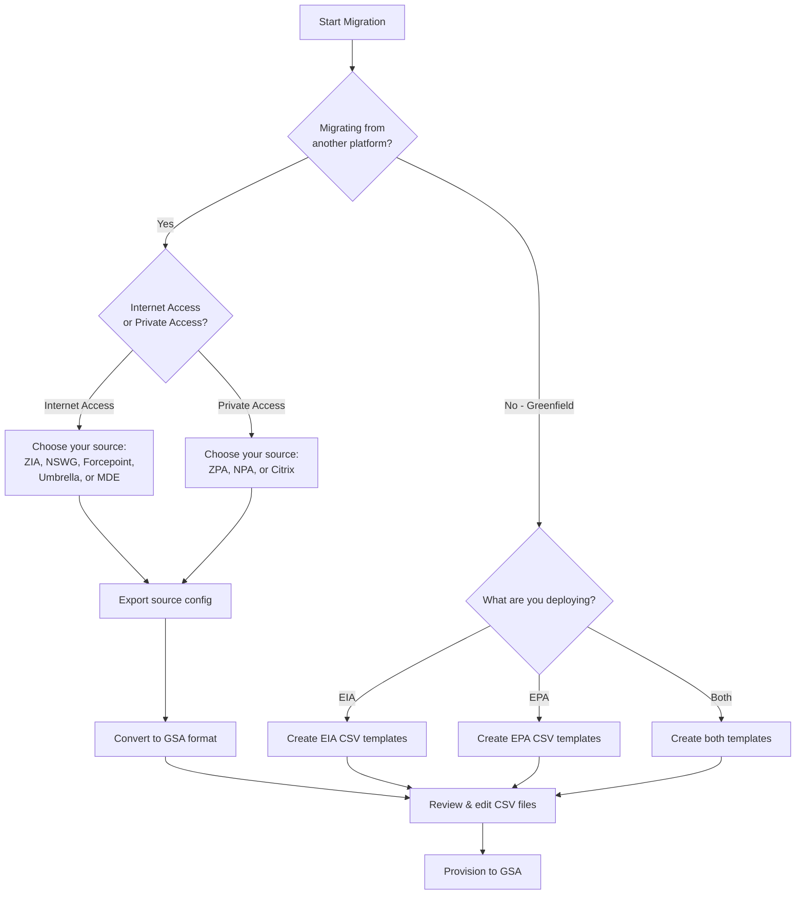

# Migration Scenarios

This page provides a quick reference to help you navigate the migration workflow based on your specific scenario. Each migration follows a structured 4-phase approach when applicable: **Export** → **Convert** → **CSV Review** → **Provision**.

## Understanding the Table

- ✅ **Available**: Documentation is ready - click the link to view the guide
- ⚠️ **Coming Soon**: Feature is under development
- **N/A**: Not applicable for this scenario
- **📝 Manual Review**: Review and edit CSV files before provisioning (no automated tool needed)

:::tip
New to Global Secure Access? Start with the [Understanding GSA](./UnderstandingGSA/EIA-Configuration-Model.md) section to learn the core concepts before beginning your migration.
:::

## Migration Workflow by Scenario

<table>
<thead>
<tr>
<th style={{minWidth: '250px'}}>Scenario</th>
<th style={{minWidth: '150px'}}>Export</th>
<th style={{minWidth: '150px'}}>Convert</th>
<th style={{minWidth: '150px'}}>CSV Review</th>
<th style={{minWidth: '150px'}}>Provision</th>
</tr>
</thead>
<tbody>

{/* EIA Migrations */}
<tr>
<td colspan="5" style={{backgroundColor: 'var(--ifm-color-primary-lightest)', fontWeight: 'bold', padding: '0.75rem'}}>
🌐 Entra Internet Access (EIA) Migrations
</td>
</tr>

<tr>
<td><strong>ZScaler Internet Access → EIA</strong></td>
<td><a href="./MigrationSources/ZScaler/ZIAExport">✅ Export ZIA</a></td>
<td><a href="./MigrationSources/ZScaler/ZIA2EIA">✅ Convert ZIA2EIA</a></td>
<td><a href="./WorkingWithCSVs/eia-csv-configuration#validation-checklist">📝 Review & Validate</a></td>
<td><a href="./Provision/EntraInternetAccessProvisioning">✅ Provision EIA</a></td>
</tr>

<tr>
<td><strong>Netskope Web Gateway → EIA</strong></td>
<td><a href="./MigrationSources/Netskope/NetskopeExportConfig">✅ Export Netskope</a></td>
<td><a href="./MigrationSources/Netskope/ConvertNSWG2EIA">✅ Convert NSWG2EIA</a></td>
<td><a href="./WorkingWithCSVs/eia-csv-configuration#validation-checklist">📝 Review & Validate</a></td>
<td><a href="./Provision/EntraInternetAccessProvisioning">✅ Provision EIA</a></td>
</tr>

<tr>
<td><strong>Forcepoint Web Security → EIA</strong></td>
<td>⚠️ Coming Soon</td>
<td><a href="./MigrationSources/Forcepoint/ConvertForcepointWS2EIA">✅ Convert Forcepoint2EIA</a></td>
<td><a href="./WorkingWithCSVs/eia-csv-configuration#validation-checklist">📝 Review & Validate</a></td>
<td><a href="./Provision/EntraInternetAccessProvisioning">✅ Provision EIA</a></td>
</tr>

<tr>
<td><strong>Cisco Umbrella → EIA</strong></td>
<td><a href="./MigrationSources/CiscoUmbrella/UmbrellaExport">✅ Export Umbrella</a></td>
<td>⚠️ Coming Soon</td>
<td><a href="./WorkingWithCSVs/eia-csv-configuration#validation-checklist">📝 Review & Validate</a></td>
<td><a href="./Provision/EntraInternetAccessProvisioning">✅ Provision EIA</a></td>
</tr>

<tr>
<td><strong>Microsoft Defender for Endpoint → EIA</strong></td>
<td><a href="./MigrationSources/DefenderForEndpoint/MDEExport">✅ Export MDE</a></td>
<td>⚠️ Coming Soon</td>
<td><a href="./WorkingWithCSVs/eia-csv-configuration#validation-checklist">📝 Review & Validate</a></td>
<td><a href="./Provision/EntraInternetAccessProvisioning">✅ Provision EIA</a></td>
</tr>

{/* EPA Migrations */}
<tr>
<td colspan="5" style={{backgroundColor: 'var(--ifm-color-success-lightest)', fontWeight: 'bold', padding: '0.75rem'}}>
🔐 Entra Private Access (EPA) Migrations
</td>
</tr>

<tr>
<td><strong>ZScaler Private Access → EPA</strong></td>
<td><a href="./MigrationSources/ZScaler/ZPAExport">✅ Export ZPA</a></td>
<td><a href="./MigrationSources/ZScaler/ZPA2EPA">✅ Convert ZPA2EPA</a></td>
<td><a href="./WorkingWithCSVs/epa-csv-configuration#validation-checklist">📝 Review & Validate</a></td>
<td><a href="./Provision/EntraPrivateAccessProvisioning">✅ Provision EPA</a></td>
</tr>

<tr>
<td><strong>Netskope Private Access → EPA</strong></td>
<td><a href="./MigrationSources/Netskope/NetskopeExportConfig">✅ Export Netskope</a></td>
<td><a href="./MigrationSources/Netskope/ConvertNPA2EPA">✅ Convert NPA2EPA</a></td>
<td><a href="./WorkingWithCSVs/epa-csv-configuration#validation-checklist">📝 Review & Validate</a></td>
<td><a href="./Provision/EntraPrivateAccessProvisioning">✅ Provision EPA</a></td>
</tr>

<tr>
<td><strong>Citrix NetScaler → EPA</strong></td>
<td>⚠️ Coming Soon</td>
<td><a href="./MigrationSources/CitrixNetscaler/ConvertCitrixNS2EPA">✅ Convert Citrix2EPA</a></td>
<td><a href="./WorkingWithCSVs/epa-csv-configuration#validation-checklist">📝 Review & Validate</a></td>
<td><a href="./Provision/EntraPrivateAccessProvisioning">✅ Provision EPA</a></td>
</tr>

{/* Greenfield Deployments */}
<tr>
<td colspan="5" style={{backgroundColor: 'var(--ifm-color-warning-lightest)', fontWeight: 'bold', padding: '0.75rem'}}>
🆕 Greenfield Deployments
</td>
</tr>

<tr>
<td><strong>Greenfield EIA Deployment</strong></td>
<td>N/A</td>
<td>N/A</td>
<td><a href="./WorkingWithCSVs/eia-csv-configuration#templates">📝 Use Templates</a></td>
<td><a href="./Provision/EntraInternetAccessProvisioning">✅ Provision EIA</a></td>
</tr>

<tr>
<td><strong>Greenfield EPA Deployment</strong></td>
<td>N/A</td>
<td>N/A</td>
<td><a href="./WorkingWithCSVs/epa-csv-configuration#templates">📝 Use Templates</a></td>
<td><a href="./Provision/EntraPrivateAccessProvisioning">✅ Provision EPA</a></td>
</tr>

{/* GSA to GSA Migrations */}
<tr>
<td colspan="5" style={{backgroundColor: 'var(--ifm-color-info-lightest)', fontWeight: 'bold', padding: '0.75rem'}}>
🔄 Global Secure Access Backup & Migration
</td>
</tr>

<tr>
<td><strong>Export Existing EIA Configuration</strong> <em>(Backup / Tenant-to-Tenant Migration)</em></td>
<td><a href="./MigrationSources/GSA/EIAExport">✅ Export EIA</a></td>
<td>N/A</td>
<td><a href="./WorkingWithCSVs/eia-csv-configuration#validation-checklist">📝 Review & Validate</a></td>
<td><a href="./Provision/EntraInternetAccessProvisioning">✅ Provision EIA</a></td>
</tr>

<tr>
<td><strong>Export Existing EPA Configuration</strong> <em>(Backup / Tenant-to-Tenant Migration)</em></td>
<td><a href="./MigrationSources/GSA/EPAExport">✅ Export EPA</a></td>
<td>N/A</td>
<td><a href="./WorkingWithCSVs/epa-csv-configuration#validation-checklist">📝 Review & Validate</a></td>
<td><a href="./Provision/EntraPrivateAccessProvisioning">✅ Provision EPA</a></td>
</tr>

</tbody>
</table>

## Migration Workflow Overview

Not sure where to start? Follow this decision tree:

## Additional Resources

- **[Migration Workflow](./migration-workflow.md)**: Detailed explanation of the 4-phase migration process
- **[Understanding GSA](./UnderstandingGSA/EIA-Configuration-Model.md)**: Learn EIA and EPA configuration models
- **[Installation Guide](./installation.md)**: Set up the Migrate2GSA PowerShell module
- **[Support Matrix](./supportmatrix.md)**: Platform compatibility and feature support

## Need Help?

If you're planning a migration project or need assistance:
- Check the platform-specific migration guides linked in the table above
- Review the [troubleshooting sections](./migration-workflow.md#troubleshooting) in each guide
- Contact the team at **migrate2gsateam@microsoft.com**

:::info
This is a community project maintained by Microsoft employees but not officially supported through Microsoft support channels. Please do not contact Microsoft support for issues with this toolkit.
:::
